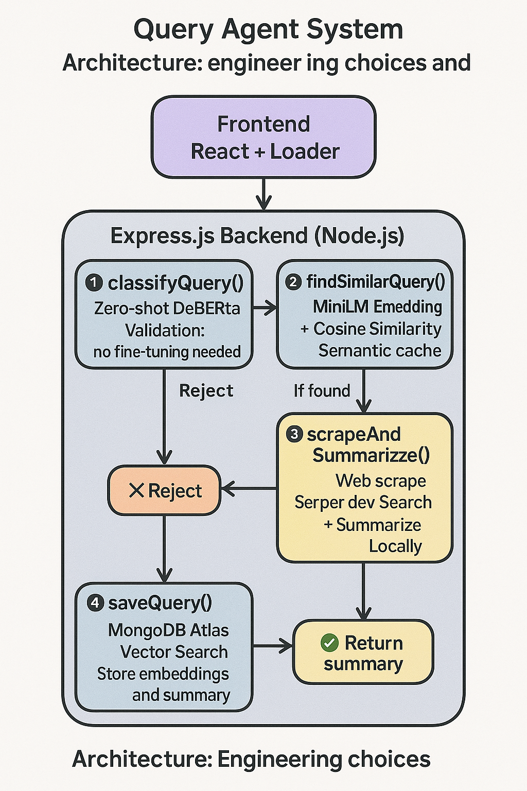

# 🌐 Web Query Agent

An intelligent full-stack agent that:

1. Accepts user queries via a React frontend  
2. Classifies queries as **valid or invalid** using a local zero-shot LLM  
3. Searches the web using **Brave Search (Serper.dev)**  
4. Scrapes and summarizes web pages using a **local transformer model**  
5. **Caches** semantically similar queries using **vector search in MongoDB Atlas**

---

## 🚀 Features

- ✅ Query classification (valid vs invalid)
- 🌐 Real-time web search via Brave (Serper.dev)
- 🧠 Local LLM-powered summarization (`Xenova/distilbart-cnn-12-6`)
- ⚡ Semantic similarity-based caching with embeddings
- 💾 Vector search in MongoDB Atlas
- ✨ Responsive React frontend with animated loader

---

## 🛠️ Tech Stack

| Layer              | Tech                                               |
|-------------------|----------------------------------------------------|
| **Frontend**       | React + CSS                                        |
| **Backend**        | Node.js + Express                                  |
| **Classification** | `@xenova/nli-deberta-base` (Zero-shot classifier) |
| **Summarization**  | `@xenova/distilbart-cnn-12-6` (Summarizer)         |
| **Embeddings**     | `@xenova/all-MiniLM-L6-v2`                         |
| **Search API**     | Serper.dev (Brave Search API)                      |
| **Vector DB**      | MongoDB Atlas + Atlas Vector Search                |

---

## 🔐 Environment Variables

Create a `.env` file inside the `backend/` directory:

```env
MONGO_URI=your_mongodb_connection_string
SERPER_API_KEY=your_serper_api_key
```

---

## 💻 Setup Instructions

### 1. Clone the Repo

```bash
git clone https://github.com/<your-username>/web-query-agent.git
cd web-query-agent
```

---

### 2. Install Dependencies

```bash
# Backend
cd backend
npm install

# Frontend
cd ../frontend
npm install
```

---

### 3. MongoDB Atlas Setup

1. Create a **MongoDB cluster** on [MongoDB Atlas](https://www.mongodb.com/cloud/atlas)
2. Under **Database Access**, add a new user with read/write access
3. Under **Network Access**, allow IPs: `0.0.0.0/0` (for development)
4. Copy your connection string into `.env` as `MONGO_URI`

#### 🧠 Vector Search Setup

1. Go to **"Search Indexes"** in your MongoDB cluster
2. Create a **new index** using the **JSON Editor**
3. Select your `queries` collection
4. Paste this config:

```json
{
  "mappings": {
    "dynamic": false,
    "fields": {
      "embedding": {
        "type": "vector",
        "dimensions": 384,
        "similarity": "cosine"
      }
    }
  }
}
```

---

### 4. Serper.dev API

1. Sign up at [https://serper.dev](https://serper.dev)
2. Generate an API key and add it to your `.env` file as `SERPER_API_KEY`

---

### 5. Run the App

```bash
# Start Backend
cd backend
node app.js

# Start Frontend (in a new terminal)
cd frontend
npm start
```

---

## 🧭 Architecture Diagram



---

## 📁 Folder Structure

```
web-query-agent/
│
├── backend/
│   ├── services/
│   │   ├── classify.js
│   │   ├── embed.js
│   │   ├── scrape.js
│   │   └── summarize.js
│   ├── routes/
│   │   └── query.js
│   ├── app.js
│   └── .env
│
├── frontend/
│   ├── src/
│   │   ├── App.js
│   │   ├── QueryForm.js
│   │   ├── ResultDisplay.js
│   │   ├── Loader.js
│   └── public/index.html
│
├── Architecture.png
└── README.md
```

---
